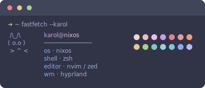

```
        ∧＿∧
      （｡･ω･｡)つ━☆・*。
      ⊂　 ノ 　　　・゜+.
       しーＪ　　　°。+ *´¨)
                 .· ´¸.·*´¨) ¸.·*¨)
                  (¸.·´ (¸.·'* hi, i'm karol
```

<br>

somewhere between poland and munich, i write code that solves problems without making new ones. systems programming, network stuff, tools that feel like they belong. nothing revolutionary, just honest work.

i believe in boring technology. the kind that lets you sleep at night. postgres over the hot new database. a framework that's been around long enough to have real answers on stackoverflow. simplicity isn't laziness, it's respect for future you.

<br>



<p align="center">
  
</p>

### things i've made

**[funnel](https://github.com/karol-broda/funnel)**
tunneling service in go. expose localhost to the world without the ceremony.

**[snitch](https://github.com/karol-broda/snitch)**
a friendlier ss/netstat. inspect network connections with a clean tui.

**[catalyst](https://github.com/karol-broda/catalyst)**
typesafe sql in python. databases shouldn't feel like guesswork.

**[zubr](https://github.com/karol-broda/zubr)**
postgres gui for when you're tired of typing the same 15 commands just to peek at your data.

**[systems work](https://karolbroda.com/projects/systems)**
low-level C stuff. databases with b+ trees, dns servers, http servers. built to understand how things actually work.

<br>

```
   /\___/\
  (  ˘ω˘  )  zzz
   )     (
```

<p align="center">
  
</p>

### how i think about code

start simple. stay simple. if it takes more than 5 minutes to explain, it's probably too complex. solve problems you actually have, not problems you might have someday. kubernetes is great when you have kubernetes-sized problems.

most of the time, a framework and postgres is enough. really.

<br>

```
   ╱|、
  (˚ˎ。7  
   |、˜〵  
   じしˍ,)ノ
```

<p align="center">
  
</p>

### elsewhere

when i'm not in the terminal, i'm probably reading another blog post about why someone rewrote their whole stack in rust. or i'm outside, touching grass (revolutionary concept, i know). sometimes i write about [keeping things simple](https://karolbroda.com/blog).

<br>

```
    ⋆ ˚｡⋆୨୧˚  ˚୨୧⋆｡˚ ⋆
    
        /\_/\  
       ( o.o ) 
        > ^ <
    
    ⋆ ˚｡⋆୨୧˚  ˚୨୧⋆｡˚ ⋆
```

<p align="center">
  
</p>

### probably not interested in

blockchain anything. adtech. "ai-powered" crud apps. your next uber-for-X. anything that requires me to say "synergy" with a straight face.

if your pitch deck has more buzzwords than technical specs, we're probably not a match. no hard feelings.

<br>

```
    /\_____/\
   /  o   o  \
  ( ==  ^  == )
   )         (
  (           )
 ( (  )   (  ) )
(__(__)___(__)__)
```

<p align="center">
  
</p>

```
    ∧,,,∧
   ( ̳• · • ̳)
   /    づ♡ say hi:

   ✦ me@karolbroda.com
   ✦ karolbroda.com
```

<br>

```
    |\      _,,,---,,_
    /,`.-'`'    -.  ;-;;,_
   |,4-  ) )-,_..;\ (  `'-'
  '---''(_/--'  `-'\_)
```

<br>

<sub>˚ ᶠᵉˡⁱˢ ᶜᵃᵗᵘˢ ˚</sub>
